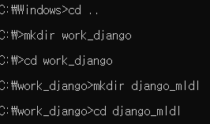
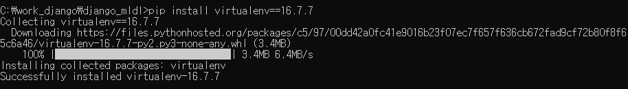
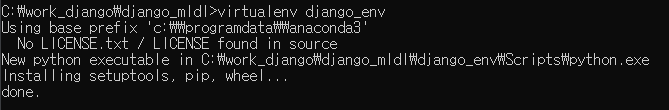
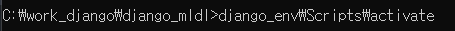

# Django 

## Django 프로젝트 폴더 및 Python 가상환경 생성

### cmd 관리자 권한으로 실행

1. c cdrive로 나간 뒤 폴더 생성

```shell
cd ..
mkdir work_django
cd work_django
mkdir django_mldl
cd django_mldl
```



2. 가상환경을 만들어주는 라이브러리 설치

   ```shell
   pip install virtualenv==16.7.7
   ```

   

3. `django_env` 가상 환경 만들기

   ```shell
   virtualenv django_env
   ```

   

4. Scripts 폴더 내에 activate 파일을 실행해 가상환경 활성화

   ```shell
   django_env\Scripts\activate
   ```

