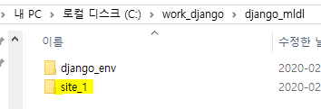
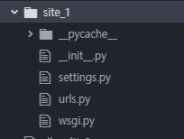

## 장고 프로젝트 생성

### C:\work_django\django_mldl

---

1. site_1 폴더 생성

   ```
   django-admin startproject site_1
   cd site_1
   ```
   
   ​	
   

   
2. Atom에서 프로젝트 폴더 열기

   File -> Add Project Folder 에서 django_mldl > site1 선택

   - `_int__.py` : site_1이 하나의 python module임을 뜻함
   - `settings.py` : `django project`에 대한 세팅
   - `urls.py` : `django project`의 URL 패턴 정의 (router)

   

3. `settings.py` 수정

   ```shell
   LANGUAGE_CODE = 'ko-kr'
   TIME_ZONE = 'Asia/Seoul'
   
   STATIC_ROOT = os.path.join(BASE_DIR, 'static')
   ```

   

   
