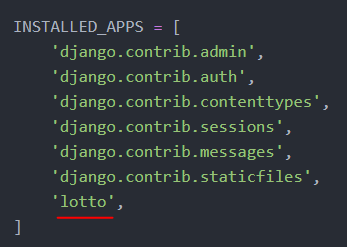

## Django APP 생성

### C:\work_django\django_mldl\site_1

---

> `app` 은 하나의 **웹사이트 내에 있는 기능들**에 해당
>
> (회원가입 기능, 상품 관련 기능 등)


1. lotto 폴더 생성

   ```shell
   python manage.py startapp lotto
   ```

   ​	


2. settings.py 파일 수정

   `INSTALLED_APPS` 내에 'lotto' 를 추가해야 함.

   `lotto` 앱이 생성됨을 의미
   
   
