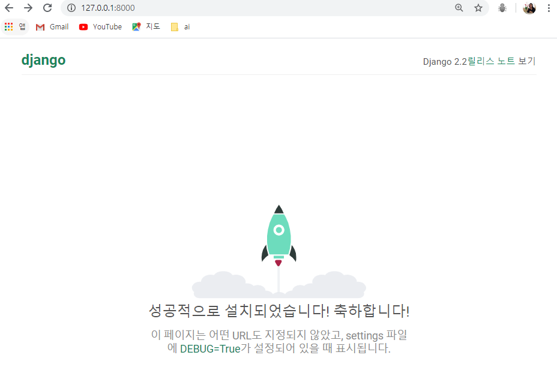

## Django Sever 실행 & 웹브라우저에서 확인

### CMD

---

1. Django Sever 실행

   (포트번호 변경을 원할 시 : python manage.py runserver <u>8888</u>)
   
   ```shell
python manage.py runserver
   ```
   
   ​	


2. 브라우저에서 127.0.0.1:8000 접속

   초기 화면 확인할 수 있음

   
