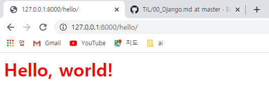

## Django urls.py & views.py

### http://127.0.0.1:8000 Hello, World!

---

#### .\site_1\site_1\urls.py

1. urls.py에서 view를 import한 뒤 path 추가

   ```python
   from lotto import views
   
urlpatterns = [
   	path('admin/', admin.site.urls),
   	path('', views.index),   # lotto > view.py 파일의 index() 함수 호출
   ]
   ```
   
   ​	


#### .\site_1\lotto\views.py

1. lotto 파일 내 views.py 파일 수정

   HttpResponse import 후 `index` 함수 정의

   ```python
   from django.http import HttpResponse
   
   def index(request):
       return HttpResponse('<h1>Hello, world!</h1>')
   ```

   ​	


**실행결과**


### http://127.0.0.1:8000/hello Hello, world!

#### .\site_1\site_1\urls.py

2. hello path 지정하기

   ```python
   path('hello', views.hello, name='hello_main'), #lotto > views.py 파일의 hello() 함수 호출
   ```

   


#### .\site_1\lotto\views.py

2. hello 함수 정의

   inner css로 style 지정. style 지정 시 <> 안에 dict 형식으로 지정해야함

   ```python
   def hello(request):
       return HttpResponse("<h1 style='color:red;'>Hello, world!</h1>")
   ```

   


**실행결과**




