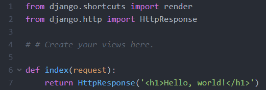

## Django models.py 변경하기

### (DB Schema 변경)

---

> - Django 에서는 DB와 소통 시 SQL을 직접 활용하는 대신 Model을 활용
> - SQL을 직접 작성하는 것보다 쉽게 DB를 다룰 수 있음.
> - ORM(Object-Relational Mapping) 을 활용한다고 말함.

#### .\site_1\lotto\models.py 파일수정

1. **GuessNumber Class 생성하기**

   models.py에서 Class는 테이블을 말함.
   
   models.Model ; Model을 상속받아 Model 안에 있는 함수를 사용할 수 있도록 함.
   
   class 내에 name, text, lottos, num_lotto, update_date 열에 대한 정의를 해줌
   
   ```python
   from django.db import models
   from django.utils import timezone
   import random
   
   # Create your models here.
   class GuessNumbers(models.Model):   # 테이블명 : GuessNumbers , models.Model: Model을 상속받아 Model 안에 있는 함수를 사용할 수 있음
       # CharField : Charicter field ; str 문자열 (데이터 타입 지정)
       # table 내 열들에 대한 정의
       name = models.CharField(max_length=24) # 로또 번호 리스트의 이름
       text = models.CharField(max_length=255) # 로또 번호 리스트에 대한 설명
       lottos = models.CharField(max_length=255,
               default='[1,2,3,4,5,6]') # 로또 번호들이 담길 str
       num_lotto = models.IntegerField(default=5) # 6개 번호 set의 갯수
       update_date = models.DateTimeField()
   ```

2. **GuessNumber 클래스 내 generate함수 정의**

   `generate` 함수는 <u>로또 번호를 자동으로 생성</u>하여 <u>현재 시간</u>과 함께 반환하는 함수임.

   1~46까지의 숫자를 `shuffl`e을 적용하여 앞에서부터 여섯개씩 뽑아내 \n으로 연결

   그 뒤 이를 str로 dtype 변경하여 `self.lottos` 빈 리스트에 넣는다.

   self.update_date 함수는 현재시간을 반환함 `timezone.now()`

   ```shell
    def generate(self):  # 로또 번호를 자동으로 생성
        self.lottos = ""
        origin = list(range(1,46))  # 1~46의 숫자 리스트
        # 6개 번호 set 갯수만큼 1~46 뒤섞은 후 앞의 6개 골라내어 sorting
        for _ in range(0, self.num_lotto):
            random.shuffle(origin)
            guess = origin[:6]
            self.lottos += str(guess) + '\n'
        self.update_date = timezone.now()
        self.save()  # GuessNumbers object를 DB에 저장

    def _str__(self):  # Admin page에서 display되는 텍스트에 대한 변경
        return "pk {} : {} - {}".format(self.pk, self.name, self.text) # pk는 자동생성됨
   ```

   ​	


### CMD 

> C:\work_django\django_mldl\site_1

3. **DB에 반영하기**(Migrate)

   > 실제 물리적인 DB 파일 : db.sqlite3

   Migration : models.spy에서의 변화를 DB Schema에 반영해주는 과정

   `python manage.py makemigrations` : models.py에서의 변화를 모아 migration file로 구성(commit)

   `python manage.py migrate` : 구성된 migration file을 바탕으로 실제 DB Schema 변경 (push)

   - **CMD**

     ```shell
     python manage.py makemigrations
     python manage.py migrate
     ```

     **실행결과**

     db.sqlite3 파일에 아스키코드 형식으로 migration이 완료된 것을 확인할 수 있음.

     

