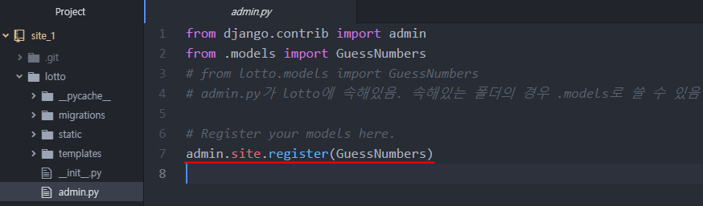
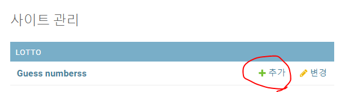
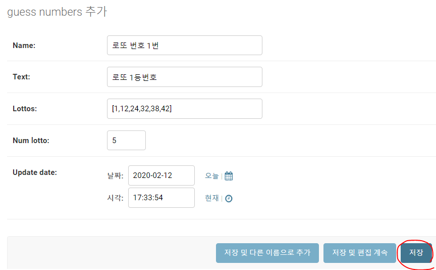
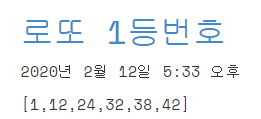

## Django admin 관리자 페이지 수정

### (admin site에 Model 객체 등록)

---

> - DB에서의 record/row에 해당

#### CMD

1. 서버를 킨 뒤 사용자이름 & 비밀번호 생성

   Username / Email / Password 입력하기
   
   >  Password는 화면에 출력되지 않음
   
   ```shell
   python manage.py runserver
   python manage.py createsuperuser
   ```
   
   ### 

### .\site1\lotto\admin.py

1. admin.py에 Model 클래스 등록

   models.py 파일로부터 GuessNumbeers class를 import 함

   ```shell
   from .models import GuessNumbers
   # form lotto.models import GuessNumbers 로 해도 무방
   
   admin.site.register(GuessNumbers)
   ```

   

   admin page를 새로고침함

### http:/127.0.0.1:8000/admin

> admin 사이트에서 Model 객체 추가

	- admin page에서 Guess numberss +추가 클릭
	- guess number 추가 페이지에 Name, Text, Lottos, Update date 열 데이터값 입력






#### 실행결과

http:/127.0.0.1:8000/lotto 에 다음과 같이 입력된 것을 확인할 수 있음

