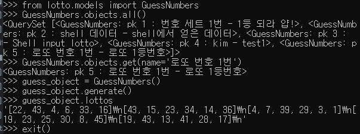

## Django shell 활용하기

### shell을 활용해 만들어 둔 장고 프로젝트 기능 활용

---

#### CMD

> C:\work_django\django_mldl\site_1

```shell
python manage.py shell

from lotto.models import GuessNumbers
GuessNumbers.objects.all()
# GuessNumbers에 등록된 모든 열을 보여줍니다.
GuessNumbers.objects.get(name='로또 번호 1등')
# 로또 번호 1등을 가지고 있는 열을 보여줍니다.
guess_object = GuessNumbers()
# guess_object에 GuessNumbers class를 불러옵니다
guess_object.generate()
# generate 함수를 실행하여 5개의 번호를 생성합니다.
guess_object.lottos
# 생성된 5개의 번호를 보여줍니다.
exit()
```

#### 실행결과



