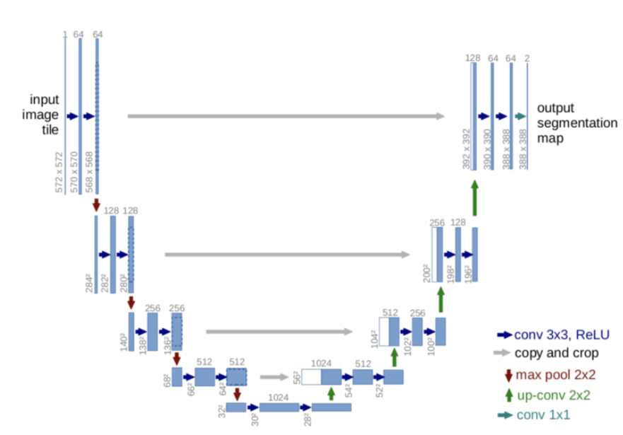
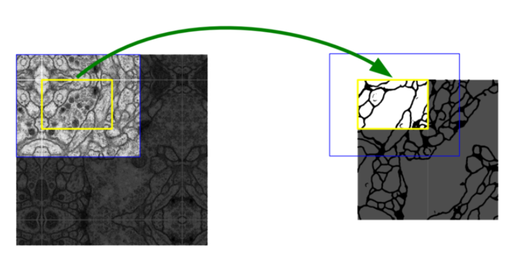
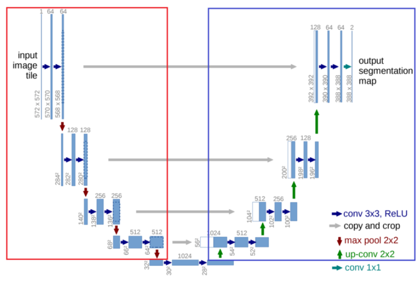
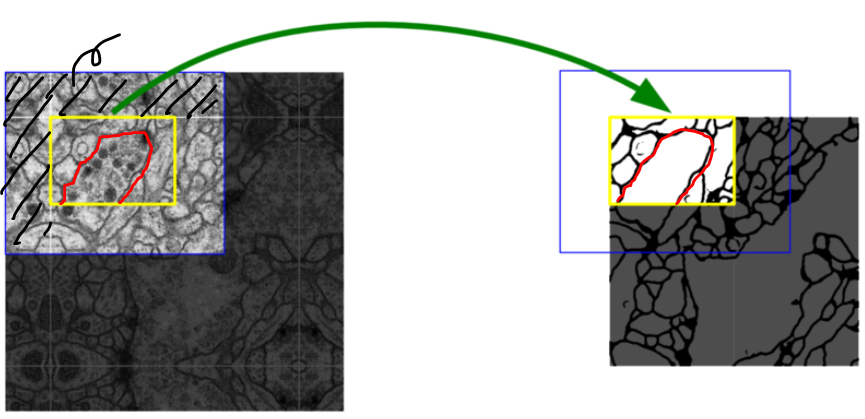
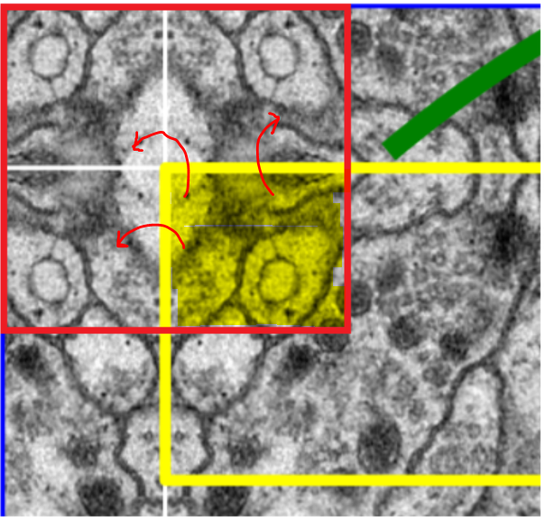
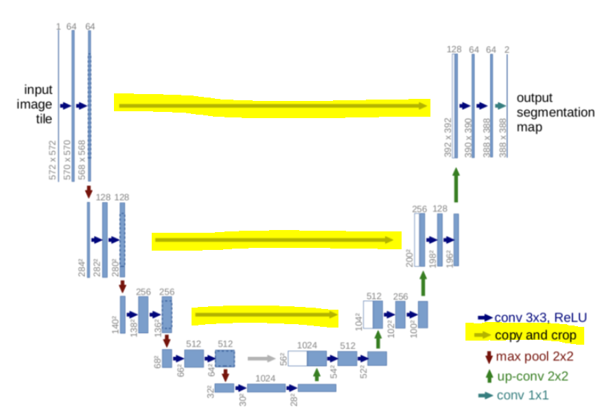

# U-net

### 1. Introduction

- **<u>U-net</u>**이란 Network 형태가 알파벳 U와 비슷하게 생겼다고 해서 U-net이라는 이름을 가지게 됨
- 의약쪽에서 탁월한 효과를 보이는 **Segmentation network**
- **Classification + Localization** 에서 주로 쓰임

### 2. Patch & Contracting Path, Expanding Path

#### 2.1 Patch

- 이미지 인식 단위 == 이미지를 잘라 인식하는 단위를 말함

#### 2.2 Contracting Path, Expanding Path

- U-net은 두개의 형태로 나뉨
- 이미지를 점점 줄여가는 부분 : **Contracting path**
  - 이미지의 context를 포착할 수 있게 함
- 이미지를 키워나가는 부분 : **Expanding path**
  - 피쳐맵 업샘플링 + contracting path의 context 결합 >> Localization

  				Contracting path				Expanding Path

#### 2.3 Context

- 이웃한 픽섹들 간의 관계
- 글을 읽고 문맥을 파악하듯, 이미지의 일부를 보고 이미지 문맥을 파악함

### 3. U-net의 장점

>  기존의 Segmentation network들의 문제를 해결함

- **빠른 속도**

  - overlap의 비율이 적음

  - Sliding Window 방식XX <u>검증이 끝난 부분을 건너뛰고</u> 다음 patch 부분부터 검증함

    > Sliding Window : 이미 사용한 patch 구역을 다음 sliding window에서 다시 검증

  - Fully connected layer 가 없음

- **Trade off의 늪에 빠지지 않는다.**

  - <u>여러 layer의 output을 동시에 검증</u> >> **Localization**과 **Context** 인식 가능

  - patch size 크기의 영향을 받지 않는다.

    - patch size가 큼 : 넓은 범위의 이미지 인식 

        Context 인식 ^ /  Localization v

    - patch size가 작음 : 좁은 범위의 이미지 인식

        Context 인식 v /  Localization ^

- **Mirroring the Input image**

  - input size : 572X572 / output size : 388X388
  - Contracting path에서 padding 없이 이미지가 줄어들게 되면서 외곽 부분의 이미지가 잘림

  

  - **손실된 외곽의 이미지를 mirroring을 이용해서 채움**

  

  ​				노란색 이미지를 좌우대칭 해 외곽(빨간색 영역)을 매워줌

  - 사라지는 부분은 zero-padding이 아닌 mirror padding의 형태로 채워 없어진 외곽에 보상을 함

### 4. Network Architecture

**Contracting Path**

- Conv 3X3, Relu
- Dropout
- max pooling 2X2
  - 1/2 down sampling

**Expanding Path**

- **up-Conv 2x2**
- **copy&crop**
  - <u>mirror padding 시 손실되는 patch를 살려주기 위한 과정</u>
  - contracting path의 데이터를 적당한 크기로 Crop(잘라냄) 후 Concat
  - input이미지가 output에 영향을 끼치도록 만듬
  - 이미지 보상처리
- Conv 3X3, Relu
- **마지막 레이어 Conv 1X1**

#### 멀티 스케일의 오브젝트 세그멘테이션을 위해서 다양한 크기의 피쳐맵을 concat 할 수 있도록 다운샘플링과 업샘플링을 순서대로 반복하는 구조

### 5. Training

- batch size 줄이고, patch 사이즈 최대화
  - GPU 사용량을 최대한 늘리게 함
- momentum = 0.99
  - input의 영향력을 최대한 키우는 방향으로 optimize

참고 : https://mylifemystudy.tistory.com/87

